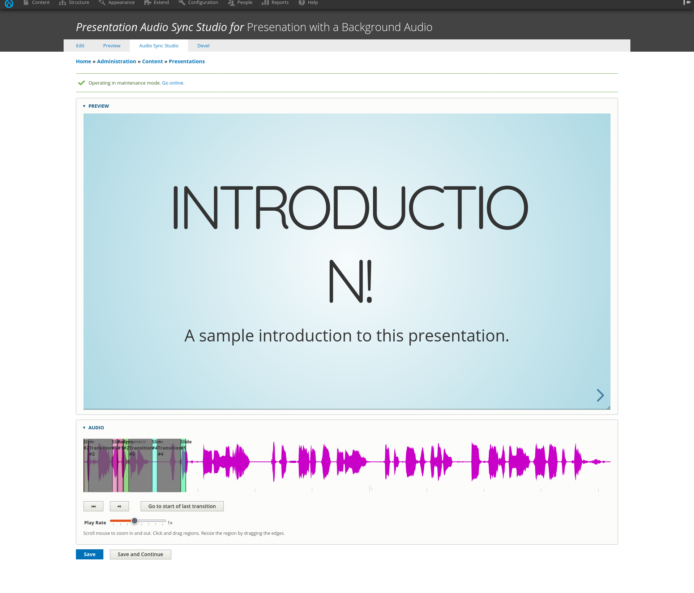
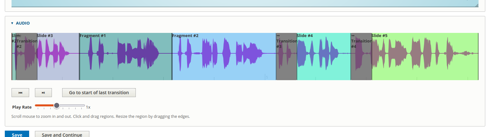

# Background Audio Guide

You can have presentations with certain set of slides that will Auto-Slide (Auto-Play) with an audio track played in the background.

You need to install the *Present Background Audio* module to use this feature. It is currently available at [https://github.com/Wickwood-LLC/present_background_audio]().

## Installation

Install the *Present Background Audio* module as you would install any other Drupal module.

## Setting Up Audio Sync Studio on a Presentation

This involves these steps:

1. Enable Background Audio Guide to a Presentation
2. Add Audio Guide Start Button to a Slide
3. Synchronize Audio with Slides

### Enable Background Audio Guide to a Presentation

!!! note
    Here we assume that you already have a presenation with slides ready to add audio guide to. If you don't have a presentation ready, you can create one by following the instructions in [Create Presentations](../create-presentations/index.md) section.

1. Go to the presentation listing page at *Content -> Presentations* in the admin menu.
2. Click on the title of the presentation you want to add a background audio guide to.
3. On the presentation edit page, select the **Background Audio** checkbox under *Reveal.js Plugins*. Save changes by clicking *Save and continue* button.
4. Settings for the background audio guide will appear at bottom under plugin settings.
5. There you will see *Audio File Path* field. Enter the path to the audio file you want to play as background audio. Save changes by clicking *Save and continue* button.

### Aduio Guide Start Button

You need to add a button to start the audio guide. You may add this button in any slide of your presentation. You also need to decided which slide you want to end the audio guide.

Let's assume you have a presenation witth 6 slides. In first slide you have and introduction to the presenation and form the second slide to the fifth slide you want to guide the audience through the presentation with a background audio. 

1. In the Presentation edit page, go to *Content* of the Slide #2.
2. Add HTML code for the audio start button:

    ``` html
    <button data-bg-audio-start-button data-bg-audio-end-slide="5">Start</button>
    ```

    The attribute *data-bg-audio-start-button* indicates it is a button to start the audio guide. The attribute *data-bg-audio-end-slide* indicates the slide number where the audio guide should end. You need to keep these two attribtibutes other wise you adjust class or other attributes of your choice for styling for other purposes.
3. Save changes by clicking *Save and continue* button.

### Synchronize Audio with Slides

In this step you decide how much time slides and fragmentations should take while the audio guide is playing.

In the presentation edit page, go to **Audio Sync Studio** tab. You should see something like this:

<figure markdown="span">
  
  <figcaption>Audio Sync Studio</figcaption>
</figure>

You have presentation preview on top and visualized audio track on the bottom. The audio track is divided into regions. Each region corresponds to a slide or a fragment or transition in the presentation.

#### Adjust the Duration of Slides and Fragments

You can adjust the duration of slides/fragments/transitions by dragging the edges of the regions. You can also drag the regions to adjust the start time of corresponding slides/fragments/transitions.

You cannot resize the regions for transitions. You can only drag them to adjust the start time. It is because the duration of transitions is fixed based on the transition speed you set on the presentation or the slide just before it. They appear in gray color. The duration of a transition will be 800 milliseconds if you set the transition speed to *default*, 400 milliseconds if you set it to *fast* and 1200 milliseconds if you set it to *slow*.

For the first time, the regions for slides and fragments will be with a minimum width set (which is 100 milliseconds). You can resize and drag them to adjust their start position and duration to match with the audio track.

In above example, only slides from #2 to #5 appeared in the audio track. That is because we start plaing the audio from the second slide and ends in 5th slide.

#### Audio Controls

You can play, pause the audio track to help you in this synchronization process. You can also adjust the play rate.

You can click anywhere on the audio track to place the play head at that position. On pressing the Play button the audio will start playing from that position.

First control button called "Got to start" helps you to put the play head at the start of the audio track. The button named "Go to start of last transition" helps you to put the play head at the start of the last transition from the current play head position.

#### Playing Preview

You can test the audio guide by clicking in the start button. In the preview, go to the slide where you put the start button and press the start button to start playing the audio guide. You should see the presentation advancing automatically as the audio plays.

#### Save

You may occassionally press the *Save audio guide* button to save your work.

Once you are done with the synchronization, you should have adjusted the regions to match the audion track covering it entirely. You should have something like this (based on above assumptions):

<figure markdown="span">
  
  <figcaption>Synchronized audio guide</figcaption>
</figure>

Press the *Save* button to go back the presentation edit page.
